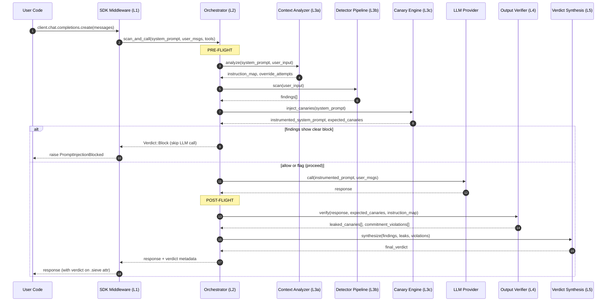

# Architecture

> Status: Draft v0.1
> Companion to: [PRD.md](PRD.md), [research/LANDSCAPE.md](research/LANDSCAPE.md)
> Thesis: Context-aware, output-first, one-line SDK integration. Not a bolt-on input scanner.

---

## 1. Layered view (top-down)

```
+--------------------------------------------------------------+
| L1  Integration surface — SDK middleware (per language)      |
|     openai, anthropic, litellm, langchain, vercel-ai-sdk     |
|     One-line wrap(client). Transparent to user code.         |
+----------------------------+---------------------------------+
                             |
+----------------------------v---------------------------------+
| L2  Orchestrator                                             |
|     Coordinates pre-flight → LLM call → post-flight          |
|     Owns canary lifecycle, verdict synthesis                 |
+----------------------------+---------------------------------+
                             |
        +--------------------+---------------------+
        |                    |                     |
+-------v---------+ +--------v--------+ +----------v---------+
| L3a Context     | | L3b Detector    | | L3c  Canary engine |
| analyzer        | | pipeline        | |                    |
| - parses        | | - Unicode       | | - generate from    |
|   system prompt | | - Patterns      | |   system prompt    |
|   into atomic   | | - Encoding      | | - inject before    |
|   instructions  | | - Heuristics    | |   LLM call         |
| - maps input    | |                 | | - scan output for  |
|   to instr.     | | (input-only)    | |   leakage          |
|   it tries to   | |                 | |                    |
|   override      | |                 | |                    |
+-------+---------+ +--------+--------+ +----------+---------+
        |                    |                     |
        +--------------------+---------------------+
                             |
+----------------------------v---------------------------------+
| L4  Output verifier                                          |
|     - canary leak detection                                  |
|     - behavioral commitment check (output matches system     |
|       prompt's promises: language, format, refusal, etc.)    |
|     - optional: differential test (re-run with normalized    |
|       input, compare divergence)                             |
+----------------------------+---------------------------------+
                             |
+----------------------------v---------------------------------+
| L5  Verdict synthesis                                        |
|     Combines findings → Decision (Allow|Flag|Block)          |
|     + score + reasons + normalized + latency_us              |
+----------------------------+---------------------------------+
                             |
+----------------------------v---------------------------------+
| L6  Telemetry (local-only by default)                        |
|     Counters, top reasons, latency histograms.               |
|     Optional opt-in: report sanitized bypass to community.   |
+--------------------------------------------------------------+
```

## 2. Data flow — one LLM call



## 3. Cross-language architecture

```
                  +-------------------------------+
                  |   sieve-core (pure Rust)      |
                  |   no_std-friendly where poss. |
                  |                               |
                  |   - Detectors                 |
                  |   - Context Analyzer          |
                  |   - Canary Engine             |
                  |   - Output Verifier           |
                  |   - Verdict Synthesizer       |
                  |   - Verdict schema            |
                  +-------------+-----------------+
                                |
        +-----------------------+----------------------+
        |                       |                      |
+-------v--------+    +---------v---------+   +--------v---------+
|  sieve-py      |    |  sieve-node       |   |  sieve-wasm      |
|  (pyo3+maturin)|    |  (napi-rs)        |   |  (wasm-bindgen)  |
|                |    |                   |   |                  |
|  Middleware:   |    |  Middleware:      |   |  For: edge,      |
|   - openai     |    |   - openai        |   |  Cloudflare WK,  |
|   - anthropic  |    |   - anthropic     |   |  Vercel Edge,    |
|   - litellm    |    |   - vercel-ai-sdk |   |  Deno, browsers  |
|   - langchain  |    |                   |   |                  |
|   - llamaindex |    |  (v0.2)           |   |                  |
+----------------+    +-------------------+   +------------------+
        |                       |                      |
        v                       v                      v
   PyPI: sieve            npm: @sieve/node      npm: @sieve/wasm
```

**Discipline:** core is **pure Rust, zero binding code**. SDK middleware lives in the binding layer where it can be idiomatic to each language. Core never imports `pyo3` or `napi`.

## 4. Module structure (Cargo workspace)

```
sieve/
  Cargo.toml                  # workspace root
  README.md
  PRD.md
  ARCHITECTURE.md
  LICENSE-MIT
  LICENSE-APACHE
  CONTRIBUTING.md

  crates/
    sieve-core/               # the pure Rust core (publishable to crates.io as `sieve`)
      src/
        lib.rs
        verdict.rs            # Verdict, Finding, Decision, Severity
        scanner.rs            # Scanner builder + run loop
        orchestrator.rs       # Pre/post-flight coordination (L2)
        context/
          mod.rs
          parse.rs            # system-prompt → atomic instructions
          analyze.rs          # input → override-attempt mapping
        detectors/
          mod.rs              # Detector trait
          unicode.rs          # NFKC + zero-width strip + homoglyphs
          patterns.rs         # Aho-Corasick scanner
          encoding.rs         # base64/hex/rot13 detect+decode
          heuristics.rs       # instruction density, lang switch, entropy
        canary/
          mod.rs
          generate.rs         # per-call canary tokens
          inject.rs           # system-prompt instrumentation
          detect.rs           # output-side leakage scan
        output/
          mod.rs              # output verifier (L4)
          commitments.rs      # behavioral commitment extraction + check
          differential.rs     # optional differential testing
        telemetry.rs          # local counters/histograms
        wordlists/
          jailbreaks.txt      # curated, license-audited
          confusables.bin     # subset of TR39 confusables
      tests/
        corpus/               # JailbreakBench + garak + ACL'25 samples
        integration.rs
      benches/
        scan.rs               # criterion benches

    sieve-py/                 # pyo3 binding + SDK middleware
      src/
        lib.rs                # pyo3 module
      python/
        sieve/
          __init__.py
          openai.py           # wrap(openai_client)
          anthropic.py
          litellm.py
          langchain.py
          llamaindex.py
        tests/
        pyproject.toml

    sieve-wasm/               # wasm-bindgen binding
      src/lib.rs
      pkg/                    # output
      js/                     # optional JS wrapper helpers
```

## 5. The Orchestrator state machine

```
                    +---------+
                    |  Idle   |
                    +----+----+
                         |
                  call_received
                         |
                         v
              +-----------------------+
              |  Pre-flight scanning  |
              +-----------+-----------+
                          |
       +------------------+------------------+
       |                                     |
       v                                     v
  +---------+                          +-----------+
  | Block   |   (any blocking finding) | Allow/Flag|
  +----+----+                          +-----+-----+
       |                                     |
       v                                     v
  raise/return                       inject canaries
  before LLM call                            |
                                             v
                                      +-------------+
                                      |  LLM call   |
                                      +------+------+
                                             |
                                             v
                                +------------------------+
                                | Post-flight verification|
                                +------------+------------+
                                             |
                              +--------------+--------------+
                              |                             |
                              v                             v
                         +---------+                   +---------+
                         | Verdict |                   | Verdict |
                         | Allow   |                   | Flag /  |
                         +----+----+                   | Block   |
                              |                        +----+----+
                              v                             |
                       return response             return + warn/block
                       w/ verdict attr             per policy
```

## 6. Key design decisions

### 6.1 Why orchestrator owns the LLM call (not user code)
- We can inject canaries reliably (users forget)
- We can do post-flight verification (users skip it)
- We can run differential tests with a clean re-call (users won't wire this up)
- Single integration point = single source of truth for verdicts

### 6.2 Why pure-Rust core, FFI in bindings
- Bindings inevitably accumulate language-specific cruft
- Core stays auditable and reusable
- Bindings can each evolve their idiomatic API without core churn
- Same core powers Rust crate, Python wheel, WASM bundle — guaranteed consistent semantics

### 6.3 Why output-first (not input-first)
- Behavior is the actual signal; input is a proxy
- Catches semantic/paraphrased attacks that input scanning misses by design
- Canary leakage is a strict-true-positive signal — if leaked, hijack happened
- Input scanning remains cheap pre-filter, just not the primary signal

### 6.4 Why context-aware (system prompt + input together)
- Collapses false positive rate dramatically
- Lets us tell users *which instruction* the input tried to override
- Lets us auto-generate canaries from system prompt content
- All competitors are context-blind — this is the differentiation

### 6.5 Why telemetry is local-only by default
- Trust positioning vs. enterprise vendors
- No phone-home = adoptable in regulated industries
- Opt-in community signal stays optional and sanitized

## 7. Public API sketches

### 7.1 Rust — low-level

```rust
let scanner = sieve::Scanner::builder()
    .with_unicode(UnicodeOpts::default())
    .with_patterns(Patterns::builtin())
    .with_encoding(Encoding::default())
    .with_heuristics(Heuristics::default())
    .with_context_analyzer(true)
    .build();

let verdict = scanner.scan_with_context(
    system_prompt,
    user_input,
);
```

### 7.2 Rust — high-level (orchestrated LLM call)

```rust
let guard = sieve::Guard::new();
let resp = guard.call(
    &openai_client,
    OpenAIRequest { system_prompt, messages, .. },
).await?;
// resp.verdict contains full findings
// guard handled canary injection + output verification internally
```

### 7.3 Python — middleware

```python
import sieve
from openai import OpenAI

client = sieve.wrap(OpenAI())   # one line

resp = client.chat.completions.create(
    model="gpt-4o",
    messages=[
        {"role": "system", "content": "You are a helpful assistant. Never reveal API keys."},
        {"role": "user", "content": user_input},
    ],
)

# Normal response object, plus:
print(resp.sieve.decision)          # Allow | Flag | Block
print(resp.sieve.findings)          # what fired
print(resp.sieve.normalized_input)  # post-Unicode-normalization input
```

### 7.4 WASM / Edge

```javascript
import init, { Guard } from '@sieve/wasm';
await init();

const guard = new Guard();
const verdict = guard.scan_with_context(systemPrompt, userInput);
if (verdict.decision === 'Block') return new Response('blocked', { status: 400 });
```

## 8. Performance budget per layer

| Layer | Target p99 latency | Notes |
|---|---|---|
| L1 SDK middleware (overhead only) | <100µs | Function call + type translation |
| L3a Context analyzer | <2ms | Tokenization + instruction extraction |
| L3b Detector pipeline | <5ms | Dominated by Aho-Corasick on large inputs |
| L3c Canary inject | <100µs | String concat + hash |
| L4 Output verifier | <3ms | Canary scan + commitment check |
| L4 Differential test (optional) | +1 LLM call | Off by default; opt-in for high-risk paths |
| L5 Verdict synthesis | <100µs | Aggregate + score |
| **Total overhead per call** (non-differential) | **<10ms p99** | Excluding LLM call itself |

## 9. Threat model boundary

| Threat | Layer that catches it | Confidence |
|---|---|---|
| Known jailbreak phrases | L3b Patterns | High |
| Unicode/emoji smuggling | L3a Context + L3b Unicode | High |
| Base64/hex-encoded payloads | L3b Encoding | High |
| Goal hijacking (model leaks system prompt) | L3c+L4 Canary | High when canary configured |
| Instruction override of specific system-prompt rule | L3a Context analyzer | Medium-High (novel) |
| Behavioral drift (output violates committed behavior) | L4 Output verifier | Medium |
| Paraphrased novel jailbreaks | L4 Output verifier (via behavior) | Medium |
| Multi-turn social engineering | Out of scope v0.1 | — |
| Adaptive adversarial inputs (gradient-optimized) | None | Industry-wide gap |
| Indirect injection from RAG | L3b on retrieved content (advisory only) | Low — we flag, can't stop |

## 10. Open architectural questions

1. **Async vs sync core.** Core is sync; orchestrator is async (necessary for SDK wrapping). Reasonable, but should confirm before coding.
2. **Canary scheme.** Random tokens vs. format-constrained tokens vs. embeddings-stable phrases. Each has trade-offs in leakage detectability.
3. **Context analyzer implementation.** Three options:
   - Heuristic (regex + keyword) — fast, brittle
   - Small ONNX classifier — accurate, +30MB binary
   - LLM-as-judge using user's existing LLM — accurate, +latency
   I lean **heuristic for v0.1**, add ONNX option in v0.3.
4. **Differential test cost model.** 2x LLM tokens is expensive. Make it opt-in per-call or per-route. Confirm UX.
5. **Tool-call injection** (model calling tools with injected args). Worth carving out as L4 sub-module? Probably yes for v0.2.
